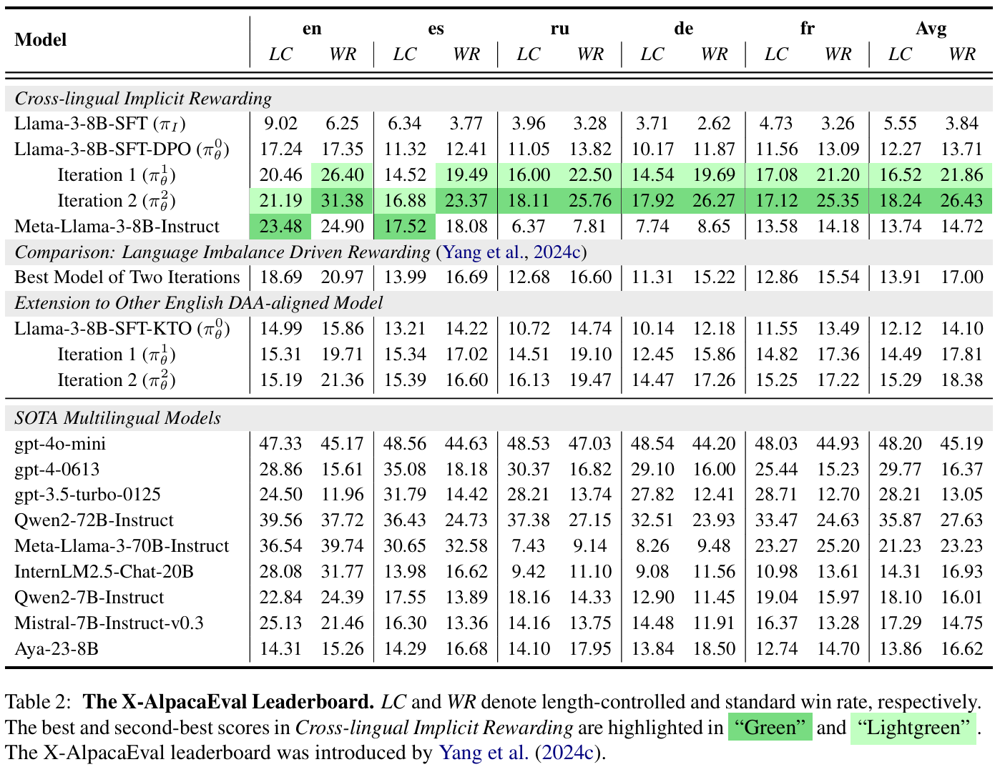

# Implicit Cross-Lingual Rewarding for Efficient Multilingual Preference Alignment

<div align="center">
<br>
<a>Wen Yang</a><sup><span>1,2</span></sup>, 
<a href="https://scholar.google.com/citations?user=Ci4l4yQAAAAJ&hl=zh-CN">Junhong Wu</a><sup><span>1,2</span></sup>,
<a href="https://scholar.google.com/citations?user=FgrrqlAAAAAJ&hl=zh-CN">Chen Wang</a><sup><span>1,2</span></sup>,
<a href="https://scholar.google.com/citations?user=l8lvKOQAAAAJ&hl=zh-CN">Chengqing Zong</a><sup><span>1,2</span></sup>,
<a href="https://scholar.google.com/citations?user=93zngeYAAAAJ&hl=zh-CN">Jiajun Zhang</a><sup><span>1,2,3,4🌟</span></sup>,
<br>
    
🌟 Corresponding author

<sup>1</sup> School of Artificial Intelligence, University of Chinese Academy of Sciences<br>
<sup>2</sup> Institute of Automation, Chinese Academy of Sciences<br>
<sup>3</sup> Wuhan AI Research
<sup>4</sup> Shanghai Artificial Intelligence Laboratory, Shanghai, China<br>
    
 <a href='https://arxiv.org/pdf/2410.08964'></a> 
</div>

## Overview
This work explores a novel perspective: *leveraging the preference knowledge embedded within existing English-aligned models to facilitate multilingual preference alignment.*
Prior work has demonstrated that the implicit reward model, derived from the logits of a well-aligned English DPO model and its reference model, effectively captures preferences over English instructions.  
Building on this, we apply this implicit reward model to the multilingual setting, using it to label preference relations in cross-lingual instruction-response pairs. This ensures that multilingual responses are evaluated based on their alignment with English instructions.
We term *Implicit Cross-Lingual Rewarding*, which preserves reward signal fidelity by directly evaluating multilingual responses under English instructions, avoiding translation-induced distortions.

<p align="center">
    
</p>

Our approach involves three key steps:

+ Multilingual response generation: Starting from any multilingual model that is DPO-tuned on English preference data from an initial reference model. Responses are sampled by the model from multilingual prompts. 

+ Implicit cross-lingual rewarding: Constructing cross-lingual instruction-response pairs by pairing English instructions with sampled multilingual responses. The implicit reward model then assigns preference scores to these responses, capturing the model's learned preference knowledge.

+ Preference Transfer Training: Our approach adopts iterative DPO similar to previous works, incorporating a negative log-likelihood (NLL) loss term to train on the multilingual preference data, thereby transferring preferences across languages.

## 🔥 Update

- [06/03/2025]🔥We release the [code](https://github.com/ZNLP/Implicit-Cross-Lingual-Rewarding) for Implicit Cross-Lingual Rewarding!
- [05/03/2025]🔥Implicit Cross-Lingual Rewarding is coming! We release the [paper](https://arxiv.org/pdf/2405.15232)!

## 👀 Contents

- [Setup](#Setup)
- [Preparation](#Preparation)
- [Train](#Train)
- [Inference](#Inference)
- [Experiments](#Experiments)
- [Citation](#citation)


## 📷 Setup

Please follow the instructions below to install the required packages.


1. Clone this repository

```bash
https://github.com/ZNLP/Implicit-Cross-Lingual-Rewarding.git
```

2. Install Package

```bash
conda create -n ICR python=3.10 -y
conda activate ICR
cd Implicit-Cross-Lingual-Rewarding
pip install -r requirements.txt
```

## 💡 Preparation


```bash
bash scripts/run_pipeline.sh
```

## 📈 Train

Our training is mostly performed on [LLaMA-Factory](https://github.com/hiyouga/LLaMA-Factory) code base. Please refer to that repo for more details.

## 📈 Inference

```bash
bash scripts/batch_inference_for_xalpacaeval.sh
```

## 👀 Experiments

We provide some results in this section. More detailed results can be found in our paper.

### General Instruction Following

+ X-alpacaEval Leaderboard
<div align=center>

</div>

<div align='center'>
<details>
<summary>Click to expand more examples</summary>
<p align="center">
    
    <p align="center">The Multilingual MT-Bench Benchmark</p>
    
    <p align="center">The Multilingual NLP Benchmarks</p>
</p>
</details>
</div>

### More Analysis
+ Different Implicit Rewards
<div align=center>

</div>


<div align='center'>
<details>
<summary>Click to expand more examples</summary>
<p align="center">
    
    <p align="center">Generalization to Lower-resource Languages</p>
    
    <p align="center">Scaling the Number of Training Prompts</p>
</p>
</details>
</div>

## Citation

If you find this repo useful for your research, please consider citing the paper

```
TBD
```

## Acknowledgement

We would like to thank the following repos for their great work:

+ [LLaMA-Factory](https://github.com/hiyouga/LLaMA-Factory) for providing the preference optimization framework
+ [Vllm](https://github.com/vllm-project/vllm) for the efficient inference engine with high throughput
+ [transformers](https://github.com/huggingface/transformers) for providing the model-base and fune-tuning framework
+ [SimPO](https://github.com/princeton-nlp/SimPO) for providing [Llama-3-Base-8B-SFT-DPO](https://huggingface.co/princeton-nlp/Llama-3-Base-8B-SFT-DPO) and [Llama-3-Base-8B-SFT](https://huggingface.co/princeton-nlp/Llama-3-Base-8B-SFT) as base model in our work
+ [LLaMA](https://github.com/facebookresearch/llama) for making Llama series models available


## License

This project is released under the [Apache 2.0 license](https://github.com/RainBowLuoCS/DEEM/blob/main/LICENSE). Parts of this project contain code and models from other sources, which are subject to their respective licenses.
